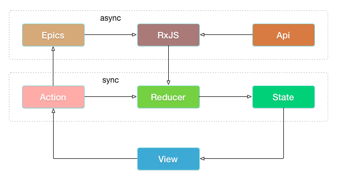

# 介绍

rxloop 是基于 [RxJS](https://github.com/ReactiveX/rxjs) 实现的超轻量级状态管理容器，核心代码仅 100 行左右，实现了 [redux](https://github.com/reactjs/redux)、[redux-observable](https://github.com/redux-observable/redux-observable)  组合的基本功能。



## 对比 Redux
Redux 是轻量级的可预测状态管理容器，是 flux 架构的最优秀实现，在 React 项目引入 Redux 可以保持良好的项目维护性，但在开发阶段，不同用途的功能函数分散在各处，要完成一个功能，需要频繁的修改这些小文件，造成了开发效率地低下。

rxloop 实现了 Redux 中基本的单向同步数据流（View -> Action -> Reducer -> State -> View），又将Redux 中分散的功能函数，收敛到一个 Model 文件中，通过派发 action 经由 reducer 对  State 实现叠加修改，借助单向数据流，保证了项目的可维护性，同时平衡了开发阶段地效率。

```javascript
const counterModel = {
  name: 'counter',
  state: 0,
  reducers: {
    increment(state) {
      return state + 1;
    },
    decrement(state) {
      return state - 1;
    }
  },
};
```

## 对比 redux-observable
Redux 不引入任何中间件的情况下，仅能处理同步请求，要处理异步逻辑，需要引入中间件，最流行的有三个：[redux-thunk](https://github.com/reduxjs/redux-thunk)、[redux-saga](https://github.com/redux-saga/redux-saga) 和[redux-observable](https://github.com/redux-observable/redux-observable)。

1. redux-thunk 通过 thunk 模式，需要在 Redux 的 ActionCreater 中处理异步逻辑，破坏了 ActionCreater 的职责单一性。
2. redux-saga 是前端 saga 模式的实现，创造性的使用 es6 的 Generator 函数，将异步逻辑封装在 sagas 之中，保证了异步逻辑的可维护性。
3. redux-observable 将 RxJS 的能力，导入到 Redux，并借助 RxJS 数据流管道实现异步逻辑，将最终结果合并到 State 之中。

实际上 RxJS 本身，也可以作为状态管理容器，项目中引入了 RxJS，就没有必要再使用 Redux，而 redux-observable 是将 RxJS 的数据管道引入到 Redux。

相比 redux-observable，rxloop 正好相反，本身借助 RxJS 的能力，轻易实现对异步逻辑的处理，同时将 Redux 的能力导入到 RxJS 之中。

完整代码:

```javascript
import rxLoop from '@rxloop/core';

const counterModel = {
  name: 'counter',
  state: 0,
  reducers: {
    increment(state) {
      return state + 1;
    },
    decrement(state) {
      return state - 1;
    },
  },
  epics: {
    loadData(action$) {
      return action$.pipe(
        // switchMap(...),
        // map(...),
        // filter(...),
        mapTo({
          action: 'increment'
        }),
      );
    }
  }
};

const app = rxLoop();
app.model(counterModel);

app.stream('counter').subscribe((state) => {
  // ele.innerHTML = state;
});

app.dispatch({ type: 'counter/increment' });
app.dispatch({ type: 'counter/loadData' });
```
## 链接
1. [代码仓库](https://github.com/TalkingData/rxloop)
2. [counter-basic](https://github.com/TalkingData/rxloop/tree/master/examples/counter-basic)
3. [todo-react](https://github.com/TalkingData/rxloop/tree/master/examples/todo-react)
